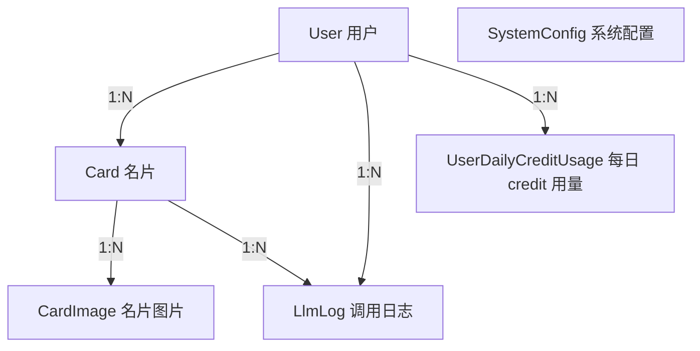

# 数据库设计

> 相关文件：`prisma/schema.prisma`

## 概述

项目使用 PostgreSQL 数据库（生产环境为 Neon serverless），通过 Prisma ORM 管理数据模型和迁移。

## ER 关系图

## 数据模型

### User（用户）

| 字段 | 类型 | 说明 |
|------|------|------|
| id | String (cuid) | 主键 |
| username | String | 唯一用户名 |
| email | String? | 可选邮箱（唯一） |
| passwordHash | String? | bcrypt 加密密码（Google 用户可为 null） |
| googleId | String? | Google OAuth 唯一标识（唯一） |
| displayName | String? | 显示名称 |
| isAdmin | Boolean | 是否为管理员（默认 false），控制 LLM 日志查看等权限 |
| createdAt | DateTime | 创建时间 |
| updatedAt | DateTime | 更新时间 |

索引：`@@index([username])`

关系：
- `Card[]` → 一对多
- `LlmLog[]` → 一对多
- `UserDailyCreditUsage[]` → 一对多

**用户来源**：
- 密码注册用户：有 `passwordHash`，无 `googleId`
- Google 登录用户：有 `googleId`，无 `passwordHash`
- 已关联用户：同时有 `passwordHash` 和 `googleId`（支持两种方式登录）

### UserDailyCreditUsage（用户每日 credit 用量）

| 字段 | 类型 | 说明 |
|------|------|------|
| id | String (cuid) | 主键 |
| userId | String | 所属用户 (FK → User.id) |
| date | DateTime @db.Date | credit 日期（由 `CREDIT_TIME_ZONE` 计算，默认 Asia/Tokyo） |
| creditsUsed | Int | 当日已使用 credit |
| createdAt | DateTime | 创建时间 |
| updatedAt | DateTime | 更新时间 |

索引：
- `@@unique([userId, date])`：确保每个用户每天只有一条用量记录
- `@@index([date])`

**设计要点**：普通用户每天默认 100 credit。创建名片时按实际关联图片数量原子预扣：单面 1 credit，双面 2 credit。管理员 `isAdmin=true` 不受限制。

### Card（名片）

| 字段 | 类型 | 说明 |
|------|------|------|
| id | String (cuid) | 主键 |
| userId | String | 所属用户 (FK → User.id) |
| fullName | String? | 姓名 |
| nameReading | String? | 姓名读音（假名/拼音） |
| company | String? | 公司 |
| title | String? | 职位 |
| email | String? | 邮箱 |
| phone | String? | 电话 |
| mobilePhone | String? | 手机 |
| address | String? | 地址 |
| website | String? | 网站 |
| department | String? | 部门 |
| fax | String? | 传真 |
| notes | String? | 备注 |
| source | String? | 来源（名片获取场合，如展会名称） |
| rawText | String? | OCR 原始文本 |
| recognitionStatus | RecognitionStatus | 识别状态（枚举） |
| viewedAt | DateTime? | 用户首次查看时间（null=未查看，用于 New 徽章） |
| processingStartedAt | DateTime? | 本轮识别开始时间（用于 stale PROCESSING 状态回收） |
| createdAt | DateTime | 创建时间 |
| updatedAt | DateTime | 更新时间 |

索引：`@@index([userId, createdAt(sort: Desc)])`

关系：
- `User` → 级联删除（删除用户时删除所有名片）
- `CardImage[]` → 一对多
- `LlmLog[]` → 一对多

### CardImage（名片图片）

| 字段 | 类型 | 说明 |
|------|------|------|
| id | String (cuid) | 主键 |
| userId | String | 上传者 (FK → User.id)，上传时即写入，用于孤儿图片鉴权 |
| cardId | String? | 所属名片 (FK → Card.id)，上传时为 null |
| side | ImageSide | 正面/反面（枚举） |
| storageKey | String | 存储系统中的键（路径或 blob 路径） |
| storageUrl | String | 可访问的 URL |
| mimeType | String | MIME 类型 |
| sizeBytes | Int | 文件大小（字节） |
| createdAt | DateTime | 创建时间 |

索引：`@@index([cardId])`、`@@index([userId])`

**设计要点**：`cardId` 允许为 null，因为图片先上传再关联到 Card。上传时图片是"孤儿"状态，创建 Card 后才关联。孤儿图片通过 `userId` 鉴权（仅上传者可访问/删除），并由 cron 任务清理超过 24 小时未关联的孤儿图片。

### LlmLog（LLM 调用日志）

| 字段 | 类型 | 说明 |
|------|------|------|
| id | String (cuid) | 主键 |
| userId | String | 调用用户 (FK → User.id) |
| cardId | String? | 关联名片 (FK → Card.id) |
| provider | String | 提供商名称（claude/alibaba） |
| model | String | 模型名称 |
| requestHeaders | Json | 请求头（API Key 已脱敏） |
| requestBody | Json | 请求体 |
| responseBody | Json | 响应体 |
| responseStatus | Int | HTTP 状态码 |
| durationMs | Int | 请求耗时（毫秒） |
| errorMessage | String? | 错误信息 |
| createdAt | DateTime | 创建时间 |

索引：
- `@@index([userId, createdAt(sort: Desc)])`
- `@@index([cardId])`

关系：
- `Card` → onDelete: SetNull（名片删除时日志保留，cardId 置空）

### SystemConfig（系统配置）

| 字段 | 类型 | 说明 |
|------|------|------|
| id | String (cuid) | 主键 |
| key | String | 配置键（唯一） |
| value | String | 配置值 |
| updatedAt | DateTime | 更新时间 |

索引：`@unique([key])`

**当前配置项**：
- `recognition_max_concurrency`：识别队列最大并发数（默认 "5"）
- `recognition_min_interval_ms`：识别请求最小间隔毫秒数（默认 "100"）
- `daily_credit_limit`：普通用户每日 credit 上限（默认 "100"）

## 枚举类型

### RecognitionStatus

| 值 | 说明 |
|----|------|
| PENDING | 待识别 |
| PROCESSING | 识别中 |
| SUCCESS | 识别成功 |
| FAILED | 识别失败 |

### ImageSide

| 值 | 说明 |
|----|------|
| FRONT | 正面 |
| BACK | 反面 |

## 数据生命周期

1. **上传**：用户上传图片 → CardImage（cardId=null）
2. **创建名片**：创建 Card 前按图片面数预扣 `UserDailyCreditUsage.creditsUsed` → 关联 CardImage
3. **识别**：后台队列自动触发 → 调用 LLM → 写入 LlmLog → 更新 Card 字段 → 状态变为 SUCCESS/FAILED
4. **查看**：用户首次打开 Card 详情 → 更新 viewedAt（清除 New 标记）
5. **删除**：删除 Card → 级联删除 CardImage（数据库级）+ 删除存储文件（应用层）
6. **用户删除**：级联删除所有 Card、LlmLog 和 UserDailyCreditUsage
