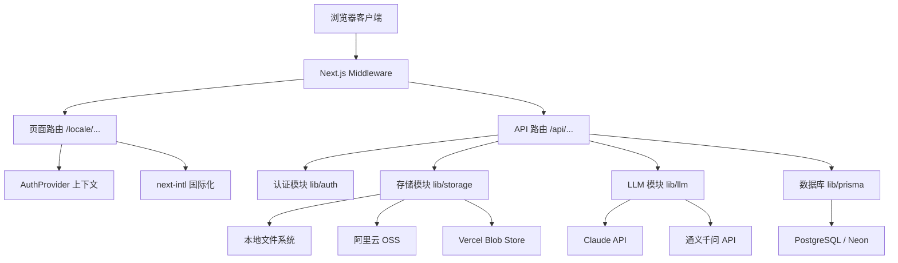
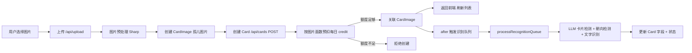
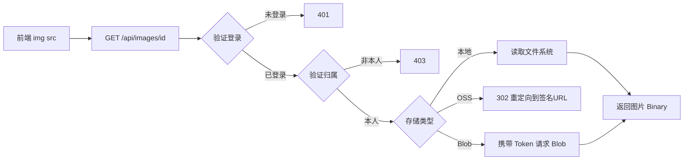

# CardVault 系统架构设计

## 项目概述

CardVault 是一个基于 AI 的名片管理 Web 应用，支持用户上传名片图片，通过大语言模型（LLM）自动识别名片上的文字信息，并提供搜索、编辑、批量管理等功能。支持多语言（中文、英文、日文）国际化。

## 技术栈

| 层级 | 技术选型 |
|------|----------|
| 前端框架 | Next.js 16.2 (App Router) + React 19 |
| UI 样式 | Tailwind CSS 4 |
| 语言 | TypeScript |
| 数据库 | PostgreSQL (Neon serverless) |
| ORM | Prisma v7 |
| 认证 | JWT (jose) + HttpOnly Cookie + Google OAuth 2.0 |
| 文件存储 | 本地文件系统 / 阿里云 OSS (STS 临时令牌) / Vercel Blob (备选) |
| AI 识别 | Claude API / 阿里巴巴通义千问 API |
| 国际化 | next-intl |
| 部署 | Vercel |

## 系统架构图



## 目录结构

```
src/
├── app/
│   ├── [locale]/              # 国际化页面路由
│   │   ├── cards/             # 名片管理页面
│   │   │   ├── [id]/page.tsx  # 名片详情/编辑页
│   │   │   └── page.tsx       # 名片列表页
│   │   ├── login/page.tsx     # 登录页
│   │   ├── register/page.tsx  # 注册页（已禁用，重定向到登录）
│   │   ├── layout.tsx         # 局部布局
│   │   └── page.tsx           # 首页（重定向到 cards）
│   ├── api/                   # API 路由
│   │   ├── auth/              # 认证 API
│   │   ├── cards/             # 名片 CRUD API
│   │   ├── credits/           # 每日 credit 状态 API
│   │   ├── images/            # 图片代理 API
│   │   ├── llm-logs/          # LLM 日志 API
│   │   └── upload/            # 图片上传 API
│   ├── layout.tsx             # 根布局
│   └── globals.css            # 全局样式
├── components/
│   ├── cards/                 # 名片相关组件
│   ├── layout/                # 布局组件
│   └── ui/                    # 通用 UI 组件
├── contexts/
│   └── auth-context.tsx       # 认证上下文
├── i18n/                      # 国际化配置
├── lib/
│   ├── llm/                   # LLM 调用封装
│   ├── storage/               # 存储抽象层
│   ├── auth.ts                # 认证工具
│   ├── credits.ts             # 每日 credit 配额与原子预扣
│   ├── image-processing.ts    # 图片处理（含压缩优化）
│   ├── prisma.ts              # Prisma 客户端
│   ├── recognition-queue.ts   # 识别队列调度
│   └── utils.ts               # 通用工具
└── middleware.ts              # 中间件（认证 + 国际化）
```

## 核心模块

| 模块 | 文档 | 职责 |
|------|------|------|
| 数据库 | [database.md](./database/database.md) | 数据模型、关系、索引 |
| 认证 | [auth.md](./auth/auth.md) | 用户登录（密码/Google OAuth）、JWT、中间件保护 |
| 存储 | [storage.md](./storage/storage.md) | 文件上传/删除、私有访问代理 |
| LLM | [llm.md](./llm/llm.md) | AI 名片识别、卡片检测、后台识别队列 |
| API | [api.md](./api/api.md) | RESTful API 路由设计 |
| 前端 | [frontend.md](./frontend/frontend.md) | 页面组件、交互逻辑 |

## 核心数据流

### 名片创建与识别流程



### 图片访问流程（私有模式）



## 设计原则

1. **工厂模式**：LLM 和存储模块通过工厂函数按环境变量动态选择实现
2. **分层架构**：API 路由 → 业务逻辑（lib/）→ 数据层（Prisma）
3. **安全优先**：JWT HttpOnly Cookie、私有存储（OSS/Blob）、资源归属校验
4. **多租户隔离**：所有数据操作均带 `userId` 过滤，确保用户只能访问自己的数据
5. **成本保护**：普通用户每日 100 credit，创建名片时按单面/双面原子预扣，限制免费开放时的 LLM 消耗
6. **优雅降级**：LLM 错误时记录日志并标记状态为 FAILED，不中断主流程
