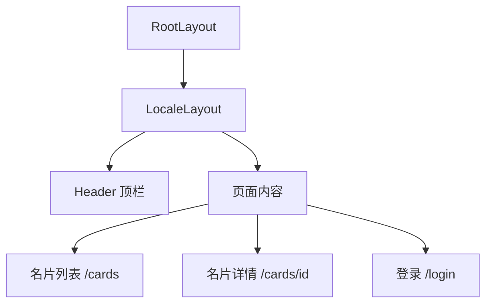
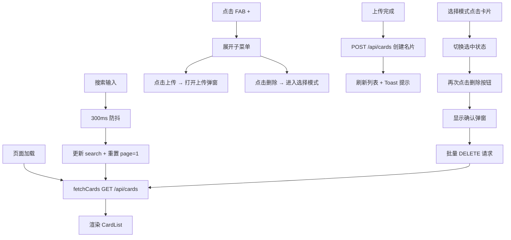

# 前端页面与组件

> 相关文件：
> - `src/app/[locale]/` — 页面路由
> - `src/components/` — 可复用组件
> - `src/contexts/auth-context.tsx` — 认证状态管理
> - `src/i18n/` — 国际化配置

## 概述

前端采用 Next.js App Router + React 19，使用客户端组件（`"use client"`）进行交互式页面渲染。样式使用 Tailwind CSS 4，图标使用 Lucide React。

## 页面结构



## 布局层级

### RootLayout (`src/app/layout.tsx`)

- 配置全局元数据（标题、描述）
- 加载 Geist 字体
- 设置 `<html>` 和 `<body>` 基础样式

### LocaleLayout (`src/app/[locale]/layout.tsx`)

- `NextIntlClientProvider` — 提供国际化上下文
- `AuthProvider` — 提供认证状态
- `Header` — 顶部导航栏
- `<main>` — 页面内容区域（max-w-7xl 居中）
- `Toaster` — Sonner 通知组件

## 核心页面

### 名片列表页 (`/cards/page.tsx`)

**状态管理：**
| 状态 | 类型 | 说明 |
|------|------|------|
| cards | CardData[] | 名片数据 |
| loading | boolean | 加载状态 |
| search | string | 搜索关键词 |
| page / totalPages | number | 分页 |
| showUpload | boolean | 上传弹窗显示 |
| fabOpen | boolean | FAB 菜单展开 |
| selectMode | boolean | 选择模式 |
| selectedIds | Set<string> | 已选名片 ID |
| deleteConfirmOpen | boolean | 删除确认弹窗 |

**交互流程：**



**UI 结构：**
1. 粘性搜索栏（fixed below header）
2. 名片网格列表（1-2-3-4 列响应式）
3. 分页控件
4. 上传模态弹窗
5. 删除确认模态弹窗
6. 右下角 FAB（浮动操作按钮）+ 子菜单

### 名片详情页 (`/cards/[id]/page.tsx`)

**功能：**
- 左侧：名片正反面图片预览
- 右侧：12 个字段的编辑表单 + 备注文本域
- 操作按钮：保存、删除、重新识别、查看日志
- 自动识别：URL 带 `?autoRecognize=1` 时自动触发

**响应式断点：** `min-[480px]:grid-cols-[280px_1fr]`（小于 480px 为单列堆叠）

**自动识别逻辑：**
```
条件：autoRecognize=1 且 card.status=PENDING 且 images.length>0
→ 仅触发一次（useRef 标记）
→ 调用 POST /api/cards/{id}/recognize
→ 成功后更新表单字段
```

**上传流程说明：**

上传与 AI 识别已解耦。用户上传名片后，前端立即刷新列表展示新卡片（处于"未识别"状态），后台队列自动调度识别。上传完成后不再跳转详情页。

## 核心组件

### CardList

名片网格列表容器，管理三种状态：
- **加载中**：8 个骨架屏动画
- **空状态**：显示图标 + 提示文案（区分"无名片"和"无搜索结果"）
- **正常**：4 列响应式网格，渲染 CardItem

### CardItem

单张名片卡片，包含：
- 缩略图区域：正面图片 / 占位符
- 状态徽章：
  - PENDING（灰色）— "未识别"，上传后等待后台识别
  - PROCESSING（黄色）— "识别中"
  - FAILED（红色）— "识别失败"
  - SUCCESS — 不显示状态徽章（正常状态）
- "New" 徽章：`viewedAt === null` 时右上角显示蓝色 "New" 标记，用户查看详情后自动消除
- 信息区域：姓名、公司、职位、邮箱、电话
- 两种模式：
  - 正常模式 → Link 链接到详情页
  - 选择模式 → 点击切换选中（显示圆形勾选标记）

**图片访问：** `src={/api/images/${frontImage.id}}`（通过代理 API）

### CardSearch

防抖搜索输入框：
- 左侧搜索图标
- 右侧清空按钮（有输入时显示）
- 300ms 防抖后触发 onChange 回调
- 独立维护 `localValue`，避免父组件重渲染影响输入体验

### CardUpload

名片上传组件，管理完整上传流程：

**阶段状态机：**
```
idle → processing → front-done → processing-back → both-done
```

**功能特性：**
- 拖拽上传（react-dropzone）
- 拍照上传（移动端原生 camera input / 桌面端 webcam）
- 图片预览 + 删除
- 正反面双图上传
- LLM 卡片检测（非名片时报错）
- 错误提示 + 重试按钮

**子组件 CameraCapture：**
- 桌面端 webcam 捕获
- 前后摄像头切换
- 拍照生成 JPEG file
- 错误提示（无摄像头时）

## 布局组件

### Header

顶部导航栏：
- 左侧：CardVault Logo + 版本号
- 右侧：语言切换器 + 用户菜单
- 用户菜单：显示名称 + 修改密码按钮 + 登出按钮
- 未登录时：显示登录按钮

### ChangePasswordModal

修改密码弹窗组件（`src/components/auth/change-password-modal.tsx`）：
- 三个密码输入框：当前密码 / 新密码 / 确认新密码
- 每个输入框支持显示/隐藏密码切换
- 前端验证：必填、最小长度、两次输入一致
- 调用 `POST /api/auth/change-password`
- 成功后强制重新登录（清除认证状态 + 跳转登录页）

### LocaleSwitcher

语言切换下拉菜单，支持 en / zh / ja 三种语言。

## 国际化

配置文件：`src/i18n/routing.ts`

```typescript
locales: ["en", "zh", "ja"]
defaultLocale: "en"
```

翻译文件位于 `messages/{locale}.json`，使用 `useTranslations(namespace)` Hook 获取翻译函数。

## 状态管理

- **服务端状态**：每个页面使用 `useEffect` + `fetch` 获取数据，无全局状态库
- **认证状态**：`AuthContext`（React Context）
- **局部 UI 状态**：`useState`（弹窗、加载、选择等）
- **通知**：Sonner toast（success/error）

## 路由导航

使用 `@/i18n/navigation` 提供的 `Link` 组件和 `useRouter` Hook，自动处理 locale 前缀。

```typescript
import { Link } from "@/i18n/navigation";
import { useRouter } from "@/i18n/navigation";

// 使用时无需手动拼 locale
<Link href="/cards">名片列表</Link>
router.push("/cards");
```
