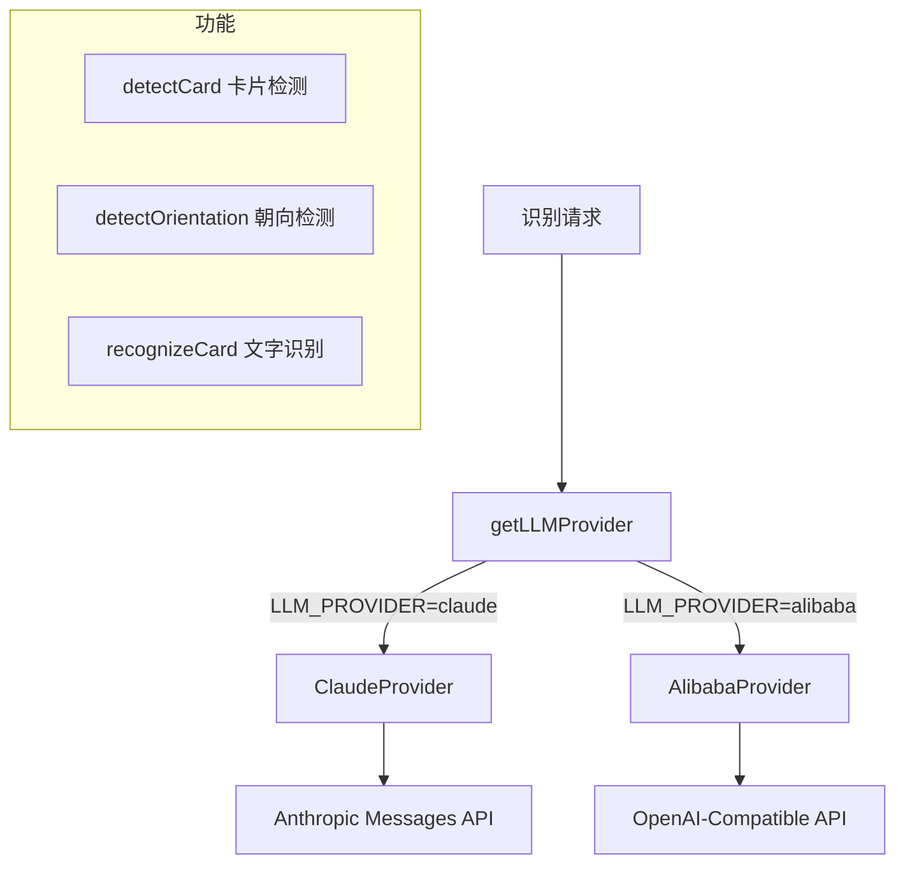
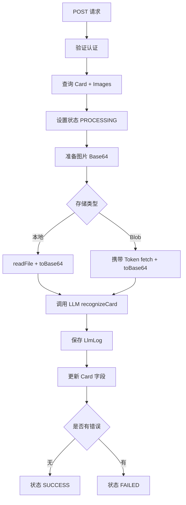

# LLM AI 识别模块

> 相关文件：
> - `src/lib/llm/types.ts` — 类型定义
> - `src/lib/llm/index.ts` — 工厂函数
> - `src/lib/llm/prompt.ts` — 提示词模板
> - `src/lib/llm/claude-provider.ts` — Claude API 实现
> - `src/lib/llm/alibaba-provider.ts` — 通义千问 API 实现
> - `src/lib/recognition-queue.ts` — 识别队列调度逻辑
> - `src/app/api/cards/[id]/recognize/route.ts` — 手动识别 API 入口
> - `src/app/api/cron/recognize/route.ts` — Cron 兜底触发端点

## 概述

LLM 模块负责名片图片的 AI 处理，包含三个核心功能：
1. **卡片检测**（detectCard）：判断图片是否为名片，返回边界框坐标
2. **朝向检测**（detectOrientation）：检测名片朝向，返回需旋转的角度（0°/90°/180°/270°）
3. **文字识别**（recognizeCard）：从名片图片中提取结构化信息

模块采用**工厂模式**，支持 Claude 和阿里巴巴通义千问两种 LLM 提供商。

## 架构图



## 类型系统

### ImageInput（图片输入）

```typescript
interface ImageInput {
  url: string;           // 存储 URL（用于日志）
  base64?: string;       // Base64 编码内容
  mimeType: string;      // 如 "image/jpeg"
  side: "FRONT" | "BACK";
}
```

### RecognitionResult（识别结果）

包含 12 个可选字段，对应名片上常见信息：

| 字段 | 说明 |
|------|------|
| fullName | 姓名（原始文字，如汉字） |
| nameReading | 姓名读音（假名/拼音） |
| company | 公司名 |
| title | 职位 |
| email | 邮箱 |
| phone | 固定电话 |
| mobilePhone | 手机号 |
| address | 地址 |
| website | 网站 |
| department | 部门 |
| fax | 传真 |
| notes | 其他信息（社交账号等） |
| rawText | 名片上所有可见文字 |

### CardDetectionResult（检测结果）

```typescript
interface CardDetectionResult {
  isCard: boolean;        // 是否为名片
  confidence: number;     // 置信度 0-1
  boundingBox: {          // 边界框（归一化到 0-1000）
    x1: number; y1: number;  // 左上角
    x2: number; y2: number;  // 右下角
  } | null;
}
```

### OrientationResult（朝向检测结果）

```typescript
interface OrientationResult {
  rotation: 0 | 90 | 180 | 270;  // 需要顺时针旋转的角度
}
```

- `0`：名片已正向（无需旋转）
- `90`：需顺时针旋转 90°
- `180`：名片上下颠倒
- `270`：需顺时针旋转 270°（即逆时针 90°）

### LLMLogEntry（日志条目）

每次 LLM 调用都会记录完整日志，用于调试和审计：

```typescript
interface LLMLogEntry {
  provider: string;              // "claude" | "alibaba"
  model: string;                 // 模型名
  requestHeaders: Record<string, string>;  // 请求头（API Key 已脱敏）
  requestBody: unknown;          // 请求体
  responseBody: unknown;         // 响应体
  responseStatus: number;        // HTTP 状态码
  durationMs: number;            // 耗时
  errorMessage?: string;         // 错误信息
}
```

## 提供商实现

### ClaudeProvider

- **API**：Anthropic Messages API (`/v1/messages`)
- **模型**：默认 `claude-sonnet-4.6`（可通过 `CLAUDE_MODEL` 配置）
- **图片格式**：Base64 内嵌（`source.type: "base64"`）
- **认证**：`x-api-key` 请求头 + `anthropic-version: 2023-06-01`

### AlibabaProvider

- **API**：OpenAI-Compatible 格式 (`/chat/completions`)
- **模型**：默认 `qwen3.7-max`（可通过 `ALIBABA_MODEL` 配置）
- **图片格式**：Base64 Data URL（`data:image/jpeg;base64,...`）
- **认证**：`Authorization: Bearer {key}`
- **特殊参数**：`enable_thinking: false`（禁用思考过程输出）

## 提示词设计

### 卡片检测提示词

指导模型：
1. 判断图像是否为名片（区分名片 vs 文档/收据/证件等）
2. 返回归一化边界框坐标（0-1000 尺度）
3. 输出严格 JSON 格式

### 文字识别提示词

关键指令：
- **保留原始语言**：不翻译任何内容
- **日文名片**：提取汉字姓名 + 假名读音（ふりがな）
- **中文名片**：如有拼音则提取到 nameReading
- **前后双面**：合并两面信息
- **电话号码**：保留国际区号，区分固话和手机
- **输出格式**：纯 JSON，无额外文本

## 识别队列调度 (recognition-queue.ts)

名片上传后不再阻塞等待识别，而是通过后台队列异步处理。

### 触发方式

1. **即时触发**：`POST /api/cards` 创建名片后，通过 `after()` 回调触发 `processRecognitionQueue()`
2. **Cron 兜底**：`GET /api/cron/recognize` 每分钟由 Vercel Cron 调用，处理漏网之鱼

### 队列处理逻辑 (`processRecognitionQueue`)

1. 从 `SystemConfig` 读取 `recognition_max_concurrency` 和 `recognition_min_interval_ms`
2. 查询当前 PROCESSING 状态卡片数量
3. 如已达到最大并发数，跳过本次处理
4. 取可用槽位数的 PENDING 卡片（按 createdAt ASC）
5. 依次处理，每个卡片之间保持最小间隔

### 重试策略

- 遇到 HTTP 429（限流），状态回退为 PENDING 等待下次处理
- 单次处理内重试最多 3 次，指数退避（1s → 2s → 4s）
- 其他错误直接标记为 FAILED

### 共享识别函数 (`recognizeCard`)

核心识别逻辑从 route handler 抽取为共享函数，被队列处理和手动识别 API 共同调用。

处理流程分为两个阶段：
1. **Phase 1 - 图片处理**：对每张图片调用 `processCardImage`（LLM 检测名片区域 + 裁剪 + 压缩）。如果图片不是名片，标记为 FAILED。
2. **Phase 2 - OCR 识别**：使用裁剪后的图片调用 LLM `recognizeCard` 提取结构化字段。

## 识别 API 流程 (/api/cards/[id]/recognize)



### 结果处理

- LLM 返回的字段值经过 `str()` 函数清洗（确保为字符串类型）
- 仅覆盖非空值：`str(result.fullName) || card.fullName`（保留已有数据）
- 错误时记录日志并将状态标记为 FAILED

## 错误处理策略

| 场景 | 处理 |
|------|------|
| API Key 缺失 | 工厂函数抛出异常 |
| HTTP 请求失败 | 返回空结果 + 错误日志 |
| JSON 解析失败 | 返回 `{ rawText, notes }` 作为降级 |
| 异常错误 | catch 后重置 Card 状态为 FAILED |

## 环境变量

| 变量 | 说明 | 默认值 |
|------|------|--------|
| `LLM_PROVIDER` | LLM 提供商 | `claude` |
| `CLAUDE_BASE_URL` | Claude API 地址 | `https://api.anthropic.com` |
| `CLAUDE_API_KEY` | Claude API 密钥 | — |
| `CLAUDE_MODEL` | Claude 模型 | `claude-sonnet-4.6` |
| `ALIBABA_BASE_URL` | 通义千问 API 地址 | `https://dashscope-intl.aliyuncs.com/compatible-mode/v1` |
| `ALIBABA_API_KEY` | 通义千问 API 密钥 | — |
| `ALIBABA_MODEL` | 通义千问模型 | `qwen3.7-max` |

## 日志审计

所有 LLM 调用的完整请求/响应数据保存到 `LlmLog` 表，供前端「查看日志」功能调试使用。API Key 在日志中仅保留最后 4 位字符。
