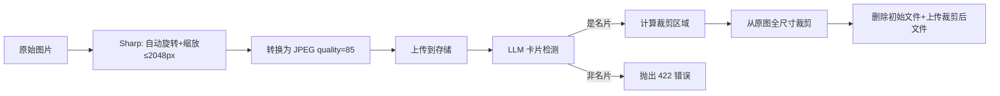

# 存储模块

> 相关文件：
> - `src/lib/storage/types.ts` — 存储接口定义
> - `src/lib/storage/index.ts` — 工厂函数
> - `src/lib/storage/local-storage.ts` — 本地文件系统实现
> - `src/lib/storage/vercel-blob.ts` — Vercel Blob 云存储实现
> - `src/app/api/images/[id]/route.ts` — 图片代理 API
> - `src/lib/image-processing.ts` — 图片预处理

## 概述

存储模块采用**策略模式**，定义统一的 `StorageProvider` 接口，通过环境变量 `STORAGE_PROVIDER` 选择具体实现。支持本地开发（文件系统）和生产部署（Vercel Blob 私有模式）无缝切换。

## 架构图

```mermaid
graph TB
    Upload[上传请求] --> Factory[getStorageProvider]
    Factory -->|STORAGE_PROVIDER=local| Local[LocalStorageProvider]
    Factory -->|STORAGE_PROVIDER=vercel| Blob[VercelBlobProvider]
    
    Local --> FS[public/uploads/年/月/uuid.jpg]
    Blob --> VB[Vercel Blob Store private]
    
    Read[图片访问] --> Proxy[/api/images/id]
    Proxy --> Auth[认证 + 权限校验]
    Auth --> LocalRead[读取本地文件]
    Auth --> BlobRead[携带 Token 请求 Blob]
```

## 接口定义

```typescript
interface StorageProvider {
  upload(file: Buffer, filename: string, mimeType: string): Promise<{
    storageKey: string;  // 存储唯一标识
    url: string;         // 可访问 URL（内部使用）
  }>;
  delete(storageKey: string): Promise<void>;
  getUrl(storageKey: string): string;
}
```

## 实现详情

### LocalStorageProvider（本地开发）

- **存储位置**：`public/uploads/{year}/{month}/{uuid}.{ext}`
- **命名规则**：UUID v4 + 原始扩展名
- **URL 格式**：`/uploads/2026/05/xxxxxxxx.jpg`
- **删除**：`fs.unlink()`，文件不存在时静默处理

### VercelBlobProvider（生产环境）

- **访问模式**：`private`（不可公开访问）
- **命名规则**：`cards/{timestamp}-{random}.{ext}`
- **上传**：使用 `@vercel/blob` 的 `put()` API
- **删除**：使用 `del()` API
- **读取**：需要携带 `BLOB_READ_WRITE_TOKEN` 授权头

额外方法：
```typescript
async fetch(blobUrl: string): Promise<Response>
// 服务端内部使用，携带认证 Token 从 Blob Store 获取内容
```

## 图片代理 API (/api/images/[id])

由于 Blob Store 为私有模式，前端无法直接访问图片 URL。所有图片通过后端代理 API 提供：

### 请求流程

1. 前端：``
2. 代理 API 验证 JWT 登录状态
3. 查询 `CardImage` 记录，确认图片存在
4. 验证资源归属：`image.card.userId === auth.userId`
5. 根据 `storageUrl` 前缀判断存储类型：
   - `/uploads/...` → 读取本地文件
   - 其他 → 携带 Token 请求 Vercel Blob
6. 返回图片 binary，设置 `Cache-Control: private, max-age=3600`

### 安全策略

- 未登录 → 401 Unauthorized
- 图片属于其他用户 → 403 Forbidden
- 孤儿图片（未关联 Card）→ 允许访问（上传者可预览）
- 图片不存在 → 404 Not Found

## 图片预处理 (image-processing.ts)

上传时的完整处理流程：



### 关键步骤

1. **预览生成**：Sharp 自动旋转（EXIF）+ 缩放到 ≤2048px
2. **LLM 检测**：发送 Base64 预览图给 LLM，获取名片边界框
3. **验证结果**：confidence ≥ 0.5 且 boundingBox 非空
4. **边距扩展**：在检测框四周各加 5% padding
5. **坐标转换**：归一化坐标(0-1000) → 预览像素坐标 → 原图像素坐标
6. **全尺寸裁剪**：对原始图片进行精确裁剪
7. **存储替换**：删除初始完整图 → 上传裁剪后图片

### 错误处理

- LLM 调用失败：抛出 502 `PROCESSING_FAILED`
- 非名片图片：抛出 422 `NOT_A_BUSINESS_CARD`
- 检测区域过小（<200x120px）：抛出 422
- 处理失败时回滚：删除已上传文件 + 删除数据库记录

## 环境变量

| 变量 | 说明 | 示例 |
|------|------|------|
| `STORAGE_PROVIDER` | 存储提供商 | `local` / `vercel` |
| `BLOB_READ_WRITE_TOKEN` | Vercel Blob 读写密钥 | `vercel_blob_rw_...` |
