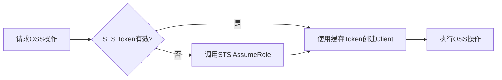
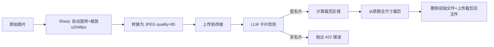

# 存储模块

> 相关文件：
> - `src/lib/storage/types.ts` — 存储接口定义
> - `src/lib/storage/index.ts` — 工厂函数
> - `src/lib/storage/local-storage.ts` — 本地文件系统实现
> - `src/lib/storage/vercel-blob.ts` — Vercel Blob 云存储实现
> - `src/lib/storage/aliyun-oss.ts` — 阿里云 OSS 实现（STS 临时令牌）
> - `src/app/api/images/[id]/route.ts` — 图片代理 API
> - `src/lib/image-processing.ts` — 图片预处理
> - `scripts/migrate-blob-to-oss.ts` — Vercel Blob → OSS 迁移脚本

## 概述

存储模块采用**策略模式**，定义统一的 `StorageProvider` 接口，通过环境变量 `STORAGE_PROVIDER` 选择具体实现。支持三种存储后端：

- `local` — 本地文件系统（开发环境）
- `vercel` — Vercel Blob 私有模式
- `aliyun-oss` — 阿里云 OSS（通过 STS 临时令牌访问，推荐生产环境）

## 架构图

```mermaid
graph TB
    Upload[上传请求] --> Factory[getStorageProvider]
    Factory -->|STORAGE_PROVIDER=local| Local[LocalStorageProvider]
    Factory -->|STORAGE_PROVIDER=vercel| Blob[VercelBlobProvider]
    Factory -->|STORAGE_PROVIDER=aliyun-oss| OSS[AliyunOSSProvider]
    
    Local --> FS[public/uploads/年/月/uuid.jpg]
    Blob --> VB[Vercel Blob Store private]
    OSS --> AliOSS[阿里云 OSS Bucket private]
    
    Read[图片访问] --> Proxy[/api/images/id]
    Proxy --> Auth[认证 + 权限校验]
    Auth --> LocalRead[读取本地文件]
    Auth --> BlobRead[携带 Token 请求 Blob]
    Auth --> OSSRedirect[302 重定向到 OSS 签名URL]
```

## 接口定义

```typescript
interface StorageProvider {
  upload(file: Buffer, filename: string, mimeType: string): Promise<{
    storageKey: string;  // 存储唯一标识
    url: string;         // 可访问 URL（内部使用）
  }>;
  delete(storageKey: string): Promise<void>;
  getUrl(storageKey: string): string;
}
```

## 实现详情

### LocalStorageProvider（本地开发）

- **存储位置**：`public/uploads/{year}/{month}/{uuid}.{ext}`
- **命名规则**：UUID v4 + 原始扩展名
- **URL 格式**：`/uploads/2026/05/xxxxxxxx.jpg`
- **删除**：`fs.unlink()`，文件不存在时静默处理

### VercelBlobProvider（Vercel 部署）

- **访问模式**：`private`（不可公开访问）
- **命名规则**：`cards/{timestamp}-{random}.{ext}`
- **上传**：使用 `@vercel/blob` 的 `put()` API
- **删除**：使用 `del()` API
- **读取**：需要携带 `BLOB_READ_WRITE_TOKEN` 授权头

额外方法：
```typescript
async fetch(blobUrl: string): Promise<Response>
// 服务端内部使用，携带认证 Token 从 Blob Store 获取内容
```

### AliyunOSSProvider（阿里云 OSS，推荐生产环境）

- **访问模式**：私有 Bucket，通过 STS 临时令牌访问
- **命名规则**：`cards/{timestamp}-{random}.{ext}`
- **URL 格式**：`oss://{storageKey}`（内部标识，非真实 URL）
- **上传/删除/读取**：通过 STS 临时凭证创建 OSS Client 操作
- **STS 缓存**：临时凭证缓存复用，到期前 5 分钟自动刷新

额外方法：
```typescript
async getSignedUrl(storageKey: string, expires?: number): Promise<string>
// 生成带签名的临时访问 URL（默认 1 小时有效）

async fetch(storageKey: string): Promise<Buffer>
// 服务端内部使用，直接从 OSS 获取文件内容
```

#### STS 工作流程



1. RAM 用户凭证（AccessKeyId/Secret）调用 STS AssumeRole API
2. 获得临时 AccessKeyId、AccessKeySecret、SecurityToken（有效期 1 小时）
3. 使用临时凭证创建 OSS Client 执行操作
4. 临时凭证缓存在内存中，到期前 5 分钟重新获取

## 图片访问优化

### 签名 URL 预生成（推荐，当前方案）

为消除前端加载图片时的 N+1 API 调用问题，列表 API 和详情 API 在返回数据时，会为每张图片预生成 OSS 签名 URL，附加到 `imageUrl` 字段中：

```
GET /api/cards → 返回卡片数据（每张图片含 imageUrl 直链）→ 前端直接 
```

- OSS 存储：批量生成签名 URL（有效期 1 小时），前端通过 `imageUrl` 字段直连 OSS
- 本地/Vercel 存储：`imageUrl` 回退为 `/api/images/{id}` 代理路径
- 前端组件使用 `image.imageUrl || /api/images/${image.id}` 做兼容处理

**性能对比**：
| 方案 | 请求数 | 典型延迟 |
|------|--------|----------|
| 旧方案（代理） | 1 + N（列表 + 每张图片） | ~3s (12张图) |
| 新方案（预签名） | 1（仅列表请求） | ~300ms |

### 图片代理 API (/api/images/[id])（兼容保留）

所有图片通过后端代理 API 提供，确保访问控制：

### 请求流程

1. 前端：``
2. 代理 API 验证 JWT 登录状态
3. 查询 `CardImage` 记录，确认图片存在
4. 验证资源归属：`image.card.userId === auth.userId`
5. 根据 `storageUrl` 前缀判断存储类型：
   - `/uploads/...` → 读取本地文件，返回图片 binary
   - `oss://...` → 生成签名 URL，返回 **302 重定向**（客户端直连 OSS，速度快）
   - 其他 → 携带 Token 请求 Vercel Blob，返回图片 binary
6. 缓存策略：`Cache-Control: private, max-age=3600`

### 安全策略

- 未登录 → 401 Unauthorized
- 图片属于其他用户 → 403 Forbidden
- 孤儿图片（未关联 Card）→ 允许访问（上传者可预览）
- 图片不存在 → 404 Not Found

## 图片预处理 (image-processing.ts)

上传时的完整处理流程：



### 关键步骤

1. **预览生成**：Sharp 自动旋转（EXIF）+ 缩放到 ≤2048px
2. **LLM 检测**：发送 Base64 预览图给 LLM，获取名片边界框
3. **验证结果**：confidence ≥ 0.5 且 boundingBox 非空
4. **边距扩展**：在检测框四周各加 5% padding
5. **坐标转换**：归一化坐标(0-1000) → 预览像素坐标 → 原图像素坐标
6. **全尺寸裁剪**：对原始图片进行精确裁剪
7. **存储替换**：删除初始完整图 → 上传裁剪后图片

### 错误处理

- LLM 调用失败：抛出 502 `PROCESSING_FAILED`
- 非名片图片：抛出 422 `NOT_A_BUSINESS_CARD`
- 检测区域过小（<200x120px）：抛出 422
- 处理失败时回滚：删除已上传文件 + 删除数据库记录

## 数据迁移

提供 `scripts/migrate-blob-to-oss.ts` 脚本，支持将已有的 Vercel Blob 数据迁移到阿里云 OSS：

- 自动识别 Vercel Blob 中的图片（排除 `/uploads/` 和 `oss://` 前缀）
- 逐个下载并上传到 OSS
- 更新数据库中的 `storageKey` 和 `storageUrl`
- 支持 `--dry-run` 预览模式和 `--batch=N` 批量控制
- 幂等设计：已迁移的图片自动跳过，可安全重复执行

## 环境变量

| 变量 | 说明 | 示例 |
|------|------|------|
| `STORAGE_PROVIDER` | 存储提供商 | `local` / `vercel` / `aliyun-oss` |
| `BLOB_READ_WRITE_TOKEN` | Vercel Blob 读写密钥 | `vercel_blob_rw_...` |
| `ALIYUN_OSS_ACCESS_KEY_ID` | RAM 用户 AccessKey ID | `LTAI5t...` |
| `ALIYUN_OSS_ACCESS_KEY_SECRET` | RAM 用户 AccessKey Secret | — |
| `ALIYUN_OSS_ROLE_ARN` | RAM 角色 ARN | `acs:ram::123456:role/xxx` |
| `ALIYUN_OSS_REGION` | OSS 区域 | `oss-ap-southeast-1` |
| `ALIYUN_OSS_BUCKET` | OSS Bucket 名称 | `cardvault-images` |
| `ALIYUN_OSS_STS_ENDPOINT` | STS 端点（可选） | `https://sts.aliyuncs.com` |
